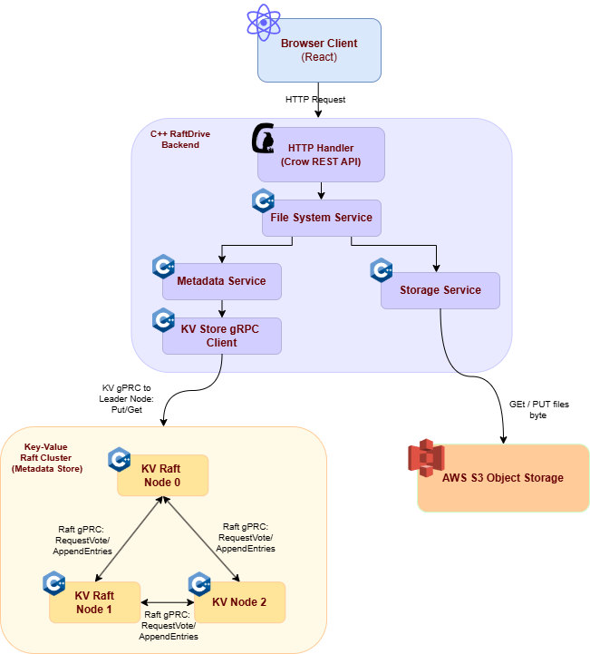

# RaftDrive

A fault-tolerant cloud file drive built from scratch in C++, inspired by Google Drive. RaftDrive uses a self-implemented Raft consensus algorithm to provide a **distributed, strongly-consistent** metadata store, with Amazon S3 (emulated locally via LocalStack) for object storage and a React frontend for file management.

<p align="center">
  <video src="https://github.com/user-attachments/assets/094ae6ca-faa9-4e30-9c44-813777af50d8" width="850" controls></video>
</p>

---

## Try It Yourself

**[🚀 https://raftdrive.vercel.app](https://raftdrive.vercel.app)**

---

## Architecture

<p align="center">
  
</p>

---

## Key Technical Decisions

### Raft Consensus (from scratch)
- Full Raft implementation: leader election, log replication, and snapshotting
- Replaced `labrpc` (in-memory test RPC from MIT 6.5840) with real gRPC transport
- Custom `RaftClient` interface abstracts the transport layer — swapping from in-process to gRPC required changing only 3 lines in `raft.cpp`
- Each node runs as an independent container, communicating over Docker's internal network

### Fault Tolerance
- The cluster tolerates **1 node failure** out of 3 (Raft majority quorum = 2)
- The cluster re-elects a new leader and resumes serving requests within 800ms of a node failure
- `raftdrive` automatically routes requests to the new leader

### Strongly-consistent Metadata
- All filesystem metadata (directories, file records, children lists) is stored as JSON values in the Raft KV store
- KV schema:
  - `dir:/path` → JSON `DirMeta`
  - `file:/path` → JSON `FileMeta` (includes `s3_key`)
  - `children:/path` → JSON array of child names
- Operations are linearizable — every read reflects all prior writes

### Object Storage
- File bytes are stored in S3 (LocalStack for local dev, real AWS in production)
- S3 keys are randomly generated (`files/<hex>-<filename>`) to avoid collisions on rename
- Metadata and object storage are decoupled — deleting a file removes the KV entry and the S3 object independently

---

## Tech Stack

| Layer | Technology |
|-------|-----------|
| Consensus | Custom Raft (C++23) |
| Inter-node RPC | gRPC + Protocol Buffers |
| HTTP API | Crow (C++ web framework) |
| Object Storage | AWS SDK C++ → S3 / LocalStack |
| Metadata Serialization | nlohmann/json |
| Frontend | React 18 + TypeScript + Vite + Tailwind CSS |
| Containerization | Docker + Docker Compose |
| Build System | CMake 3.20+ |

---

## Project Structure

```
RaftDrive/
├── proto/
│   ├── kvstore.proto          # KV gRPC service (raftdrive ↔ kvnode)
│   └── raft.proto             # Raft gRPC service (kvnode ↔ kvnode)
├── kvcluster/                 # Raft KV node binary
│   ├── raft/                  # Raft consensus implementation
│   │   ├── raft.hpp / raft.cpp
│   │   ├── raft_types.hpp     # RPC structs (extracted to break circular includes)
│   │   ├── apply_channel.hpp  # Thread-safe apply queue
│   │   ├── persister.hpp      # Raft state persistence
│   │   └── threadpool.hpp     # Thread pool for concurrent RPC dispatch
│   ├── kvserver/              # KV server on top of Raft
│   ├── transport/
│   │   ├── client_raft_abstract.hpp   # IRaftTransport interface
│   │   └── client_raft_grpc.hpp       # gRPC implementation
│   ├── service_kv_grpc.hpp    # gRPC KVStore service (handles client requests)
│   ├── service_raft_grpc.hpp  # gRPC Raft service (handles peer RPCs)
│   └── main.cpp               # kvnode entry point
├── raftdrive/                 # HTTP API server binary
│   ├── clients/
│   │   └── kv_grpc_client.hpp  # Multi-node KV client with leader retry
│   ├── services/
│   │   ├── service_metadata.hpp/cpp  # Dir/file CRUD on KV store
│   │   ├── service_storage.hpp/cpp   # S3 upload/download/delete
│   │   └── service_fs.hpp/cpp        # Combines metadata + storage
│   ├── handlers/
│   │   └── handler_fs.hpp     # HTTP request handlers
│   ├── api/
│   │   └── router.hpp         # Crow route registration
│   ├── models/
│   │   └── drive_models.hpp   # FileMeta, DirMeta, ListingResult
│   └── main.cpp               # raftdrive entry point
├── frontend/                  # React frontend
│   └── src/
│       ├── App.tsx
│       ├── api/driveApi.ts    # Fetch wrappers for all API calls
│       └── types/drive.ts     # TypeScript types
├── scripts/
│   ├── entrypoint-kvnode.sh   # Builds + starts a kvnode
│   ├── entrypoint-raftdrive.sh
│   └── init-localstack.sh     # Creates S3 bucket on LocalStack startup
├── Dockerfile                 # Single image: gRPC + AWS SDK + Crow + Node.js
└── docker-compose.yml         # 5 services: kvnode-{0,1,2} + raftdrive + localstack
```

---

## REST API

| Method | Route | Description |
|--------|-------|-------------|
| `GET` | `/api/dirs/` | List root directory |
| `GET` | `/api/dirs/<path>` | List directory at path |
| `POST` | `/api/dirs/<path>` | Create directory |
| `DELETE` | `/api/dirs/<path>` | Recursively delete directory |
| `GET` | `/api/files/<path>` | Download file bytes |
| `POST` | `/api/files/<path>` | Upload file (raw body, Content-Type header) |
| `DELETE` | `/api/files/<path>` | Delete file |

---

## Running Locally

**Prerequisites:** Docker and Docker Compose

```bash
git clone <repo-url>
cd RaftDrive

# Start all services (builds on first run — takes a few minutes)
docker compose up

# In a separate terminal, start the frontend
cd frontend
npm install
npm run dev
```

Open `http://localhost:5173` in your browser.

**Ports:**
| Service | Port |
|---------|------|
| Frontend (Vite) | 5173 |
| RaftDrive HTTP API | 8080 |
| kvnode-0 gRPC | 50050 |
| kvnode-1 gRPC | 50051 |
| kvnode-2 gRPC | 50052 |
| LocalStack (S3) | 4566 |

---

## What I Built vs. What I Used

| Component | Built from scratch | Used existing |
|-----------|-------------------|---------------|
| Raft consensus algorithm | ✅ | |
| gRPC transport layer | ✅ | |
| KV server with deduplication | ✅ | |
| Metadata service | ✅ | |
| Filesystem service | ✅ | |
| REST API + routing | ✅ | |
| React frontend | ✅ | |
| gRPC framework | | ✅ gRPC/protobuf |
| Object storage | | ✅ AWS S3 SDK |
| HTTP framework | | ✅ Crow |
| JSON serialization | | ✅ nlohmann/json |
| S3 emulation | | ✅ LocalStack |
